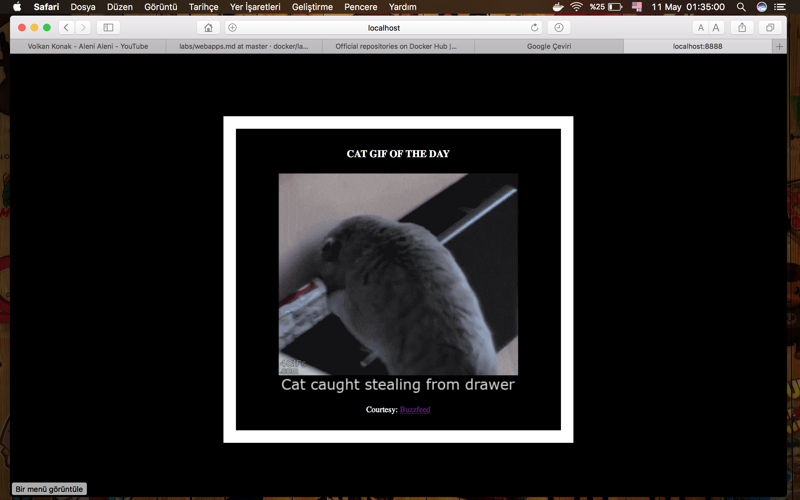

# My First Docker App

For the purposes of this workshop, we've created a fun little Python Flask app that displays a random cat `.gif` every time it is loaded - because, you know, who doesn't like cats?

>**Note:** The code for this section is in this repository in the [flask-app](https://github.com/docker/labs/tree/master/beginner/flask-app) directory.

Now that you have a better understanding of images, it's time to create your own. Our goal here is to create an image that sandboxes a small [Flask](http://flask.pocoo.org) application.

**The goal of this exercise is to create a Docker image which will run a Flask app.**

We'll do this by first pulling together the components for a random cat picture generator built with Python Flask, then _dockerizing_ it by writing a _Dockerfile_. Finally, we'll build the image, and then run it.

### 2.3.3 Build the image

Now that you have your `Dockerfile`, you can build your image. The `docker build` command does the heavy-lifting of creating a docker image from a `Dockerfile`.

When you run the `docker build` command given below, make sure to replace `<YOUR_USERNAME>` with your username. This username should be the same one you created when registering on [Docker Cloud](https://cloud.docker.com). If you haven't done that yet, please go ahead and create an account.

The `docker build` command is quite simple - it takes an optional tag name with the `-t` flag, and the location of the directory containing the `Dockerfile` - the `.` indicates the current directory:

```
$ docker build -t <YOUR_USERNAME>/myfirstapp .
Sending build context to Docker daemon 9.728 kB
Step 1 : FROM alpine:latest
 ---> 0d81fc72e790
Step 2 : RUN apk add --update py-pip
 ---> Running in 8abd4091b5f5
fetch http://dl-4.alpinelinux.org/alpine/v3.3/main/x86_64/APKINDEX.tar.gz
fetch http://dl-4.alpinelinux.org/alpine/v3.3/community/x86_64/APKINDEX.tar.gz
(1/12) Installing libbz2 (1.0.6-r4)
(2/12) Installing expat (2.1.0-r2)
(3/12) Installing libffi (3.2.1-r2)
(4/12) Installing gdbm (1.11-r1)
(5/12) Installing ncurses-terminfo-base (6.0-r6)
(6/12) Installing ncurses-terminfo (6.0-r6)
(7/12) Installing ncurses-libs (6.0-r6)
(8/12) Installing readline (6.3.008-r4)
(9/12) Installing sqlite-libs (3.9.2-r0)
(10/12) Installing python (2.7.11-r3)
(11/12) Installing py-setuptools (18.8-r0)
(12/12) Installing py-pip (7.1.2-r0)
Executing busybox-1.24.1-r7.trigger
OK: 59 MiB in 23 packages
 ---> 976a232ac4ad
Removing intermediate container 8abd4091b5f5
Step 3 : COPY requirements.txt /usr/src/app/
 ---> 65b4be05340c
Removing intermediate container 29ef53b58e0f
Step 4 : RUN pip install --no-cache-dir -r /usr/src/app/requirements.txt
 ---> Running in a1f26ded28e7
Collecting Flask==0.10.1 (from -r /usr/src/app/requirements.txt (line 1))
  Downloading Flask-0.10.1.tar.gz (544kB)
Collecting Werkzeug>=0.7 (from Flask==0.10.1->-r /usr/src/app/requirements.txt (line 1))
  Downloading Werkzeug-0.11.4-py2.py3-none-any.whl (305kB)
Collecting Jinja2>=2.4 (from Flask==0.10.1->-r /usr/src/app/requirements.txt (line 1))
  Downloading Jinja2-2.8-py2.py3-none-any.whl (263kB)
Collecting itsdangerous>=0.21 (from Flask==0.10.1->-r /usr/src/app/requirements.txt (line 1))
  Downloading itsdangerous-0.24.tar.gz (46kB)
Collecting MarkupSafe (from Jinja2>=2.4->Flask==0.10.1->-r /usr/src/app/requirements.txt (line 1))
  Downloading MarkupSafe-0.23.tar.gz
Installing collected packages: Werkzeug, MarkupSafe, Jinja2, itsdangerous, Flask
  Running setup.py install for MarkupSafe
  Running setup.py install for itsdangerous
  Running setup.py install for Flask
Successfully installed Flask-0.10.1 Jinja2-2.8 MarkupSafe-0.23 Werkzeug-0.11.4 itsdangerous-0.24
You are using pip version 7.1.2, however version 8.1.1 is available.
You should consider upgrading via the 'pip install --upgrade pip' command.
 ---> 8de73b0730c2
Removing intermediate container a1f26ded28e7
Step 5 : COPY app.py /usr/src/app/
 ---> 6a3436fca83e
Removing intermediate container d51b81a8b698
Step 6 : COPY templates/index.html /usr/src/app/templates/
 ---> 8098386bee99
Removing intermediate container b783d7646f83
Step 7 : EXPOSE 5000
 ---> Running in 31401b7dea40
 ---> 5e9988d87da7
Removing intermediate container 31401b7dea40
Step 8 : CMD python /usr/src/app/app.py
 ---> Running in 78e324d26576
 ---> 2f7357a0805d
Removing intermediate container 78e324d26576
Successfully built 2f7357a0805d
```

If you don't have the `alpine:3.5` image, the client will first pull the image and then create your image. Therefore, your output on running the command will look different from mine. If everything went well, your image should be ready! Run `docker images` and see if your image (`<YOUR_USERNAME>/myfirstapp`) shows.

### 2.3.4 Run your image
The next step in this section is to run the image and see if it actually works.

```bash
$ docker run -p 8888:5000 --name myfirstapp YOUR_USERNAME/myfirstapp
 * Running on http://0.0.0.0:5000/ (Press CTRL+C to quit)
```

Head over to `http://localhost:8888` and your app should be live. **Note** If you are using Docker Machine, you may need to open up another terminal and determine the container ip address using `docker-machine ip default`.



Hit the Refresh button in the web browser to see a few more cat images.
